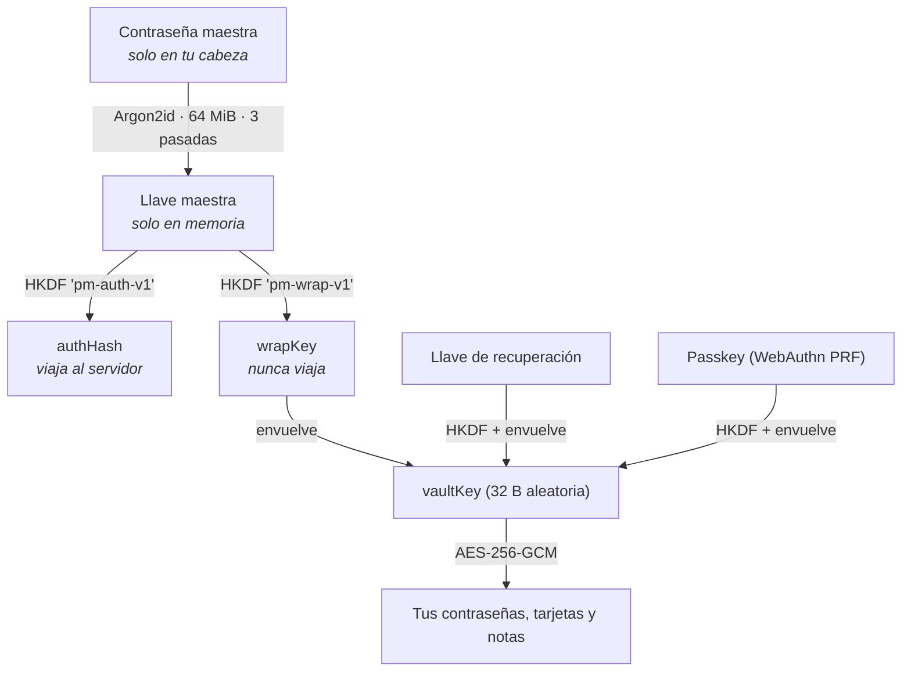

# PasswordManager

Gestor de contraseñas **zero-knowledge**: el servidor guarda tus datos pero no puede leerlos.

[](https://github.com/CristopherPaiz/PasswordManager/actions/workflows/ci.yml)

La contraseña maestra nunca sale del navegador. Todo se cifra y descifra en el cliente con AES-256-GCM, usando una llave derivada con Argon2id. Al servidor solo llegan blobs cifrados y un hash de autenticación que no sirve para descifrar nada.

La app tiene una página pública (`/security`) que explica el modelo con diagramas y una **demostración en vivo**: escribes una contraseña de prueba y ves, en tu navegador, qué viajaría al servidor, qué se guardaría en la base de datos y qué pasa si alguien altera un byte del cifrado.

---

## Índice

- [Cómo funciona la seguridad](#cómo-funciona-la-seguridad)
- [Qué NO protege](#qué-no-protege)
- [Características](#características)
- [Stack](#stack)
- [Estructura](#estructura)
- [Puesta en marcha](#puesta-en-marcha)
- [Variables de entorno](#variables-de-entorno)
- [Base de datos](#base-de-datos)
- [Tests](#tests)
- [Despliegue](#despliegue)
- [Convenciones](#convenciones)

---

## Cómo funciona la seguridad

### Jerarquía de llaves



La `vaultKey` es aleatoria e independiente de la contraseña maestra. Por eso cambiar la maestra **no** obliga a re-cifrar el baúl: solo se vuelve a envolver la misma llave.

### Qué ve el servidor

| Dato | Qué recibe el servidor |
|---|---|
| Contraseña maestra | **Nada.** Nunca sale del navegador |
| Credencial de login | `authHash` (HKDF de la llave maestra), guardado con bcrypt encima |
| Llave del baúl | Envuelta con AES-GCM; sin la `wrapKey` no se puede abrir |
| Contenido de cada elemento | `ciphertext` + `iv`. Título, usuario, contraseña, notas, carpetas, etiquetas y favoritos van **dentro** del blob |
| Tipo de elemento | En claro (`password` \| `card` \| `note`), para listar sin descifrar |
| Secreto TOTP | Cifrado en reposo con `TOTP_ENC_KEY` |

### Defensas implementadas

- **Argon2id** (64 MiB, 3 pasadas) con piso mínimo validado en el servidor: un cliente manipulado no puede registrar con parámetros triviales.
- **Migración automática del KDF**: si tu cuenta quedó con parámetros viejos, al desbloquear se re-deriva sola con los actuales, sin cambiar tu contraseña ni cerrar sesiones.
- **AAD por elemento**: el `uid` de cada fila entra en el tag GCM, así que el servidor no puede intercambiar ciphertexts entre elementos.
- **Manifiesto del baúl**: inventario cifrado (uid + digest de cada blob) con versión monótona. Detecta elementos borrados, revertidos o inyectados desde el servidor, y el rollback del baúl completo.
- **Bloqueo automático**: la llave vive solo en memoria; se pierde al recargar y por inactividad configurable.
- **2FA TOTP con anti-replay** (RFC 6238): se recuerda el último paso aceptado, así un código robado no sirve dos veces.
- **Passkeys (WebAuthn PRF)**: desbloqueo con huella o Windows Hello, una por dispositivo.
- **Llave de recuperación** de un solo uso, que se rota al usarse.
- **Login endurecido**: comparación bcrypt señuelo contra timing, salt señuelo determinista contra enumeración de usuarios, y límite de intentos **por IP y por cuenta**.
- **Sesiones**: JWT en cookie `httpOnly`, con el hash del token en base de datos para poder revocar de verdad.
- **CSRF**: verificación de `Origin` en toda mutación, además de CORS.
- **CSP estricta** sin scripts externos, más COOP/CORP y HSTS.

---

## Qué NO protege

Vale más decirlo que esconderlo:

- **Un XSS en el frontend.** Mientras el baúl está abierto la llave está en memoria del navegador. De ahí la CSP estricta y el auto-bloqueo.
- **Un servidor que sirva JavaScript modificado.** Es el límite inherente a cualquier gestor de contraseñas web. Lo que puedes hacer es leer este código y comparar lo que descarga tu navegador.
- **Una contraseña maestra débil.** Argon2id encarece cada intento; no arregla seis letras.
- **Un dispositivo comprometido.** Keylogger o malware derrotan cualquier criptografía.
- **Perder la maestra y la llave de recuperación a la vez.** No hay rescate, por diseño: si existiera una puerta de servicio, existiría para cualquiera que tome el servidor.

---

## Características

- Contraseñas, tarjetas y notas seguras, con carpetas, etiquetas y favoritos (todo dentro del blob cifrado).
- Generador de contraseñas y medidor de fuerza.
- Códigos 2FA (TOTP) guardados por elemento, con cuenta regresiva en vivo.
- Tarjetas con detección de marca y emisor, y diseño personalizable.
- Búsqueda difusa insensible a tildes sobre todo el contenido descifrado.
- Respaldo e importación cifrados (JSON/CSV) protegidos con su propia contraseña.
- Gestión de sesiones activas, con revocación remota.
- Tema claro/oscuro, español/inglés, mobile-first.
- Página pública de seguridad con demostración en vivo.

---

## Stack

**API** — Node.js 22, Express 4, TypeScript (ESM/NodeNext), Turso (libSQL), Zod, JWT, `@node-rs/bcrypt`, otplib, Helmet, Vitest + Supertest.

**UI** — React 19, Vite, TypeScript, Tailwind v4, React Router v7, TanStack Query v5, Zustand, i18next, hash-wasm (Argon2id), WebCrypto, Vitest + Testing Library.

---

## Estructura

```
api/          Express + Turso. El servidor nunca ve texto en claro.
  src/controllers/    auth (registro, login, 2FA, passkeys, recuperación), vault, errors, config, system
  src/database/       init_tables.ts es el ÚNICO archivo de esquema
  src/middlewares/    auth, admin, origin (anti-CSRF), validate (Zod)
  tests/              14 suites contra SQLite en memoria con el esquema real

ui/           React + Vite. Aquí ocurre toda la criptografía.
  src/utils/crypto.ts    núcleo: Argon2id, HKDF, AES-GCM, llave de recuperación
  src/utils/vault.ts     flujos: registro, login, recuperación, upgrade de KDF
  src/utils/manifest.ts  integridad del baúl (anti-borrado y anti-rollback)
  src/pages/public/Security.tsx   la página que explica todo esto
```

---

## Puesta en marcha

Requiere Node 22+ y pnpm 10+.

### API

```bash
cd api
pnpm install --frozen-lockfile
pnpm setup
pnpm db:init
pnpm dev
```

`pnpm setup` genera el `.env` de forma interactiva. `pnpm db:init` crea tablas e índices (es idempotente). El servidor arranca en `http://localhost:3000`.

### UI

```bash
cd ui
pnpm install --frozen-lockfile
pnpm dev
```

Crea `ui/.env` con la URL de tu API:

```
VITE_API_URL=http://localhost:3000
```

La app queda en `http://localhost:5173`. La primera cuenta se crea desde el registro: **no** se siembra ningún usuario, porque un admin sin parámetros criptográficos no podría abrir ningún baúl.

Para dar rol de administrador (necesario solo para ver el historial de errores):

```bash
cd api
pnpm db:sql "UPDATE Usuarios SET rol = 'admin' WHERE username = 'tu_usuario'"
```

---

## Variables de entorno

### `api/.env`

| Variable | Obligatoria | Descripción |
|---|---|---|
| `PORT` | sí | Puerto del servidor |
| `NODE_ENV` | sí | `development` \| `production` |
| `TURSO_DATABASE_URL` | sí | URL de la base Turso |
| `TURSO_AUTH_TOKEN` | sí | Token de Turso |
| `JWT_SECRET_KEY` | sí | Secreto de firma. Mínimo 16 caracteres; se recomiendan 32+ |
| `JWT_EXPIRATION_TIME` | sí | Duración de la sesión (ej. `7d`) |
| `SALT_ROUNDS` | sí | Coste de bcrypt (10 por defecto) |
| `TOTP_ENC_KEY` | recomendada | Cifra los secretos TOTP en reposo |
| `FRONTEND_URL` | recomendada | Origen permitido para CORS y anti-CSRF |
| `CORS_ORIGINS` | opcional | Orígenes extra separados por comas |

### `ui/.env`

| Variable | Descripción |
|---|---|
| `VITE_API_URL` | URL base de la API. También entra en la CSP del build |

---

## Base de datos

**No hay archivos de migración.** El único archivo de esquema es `api/src/database/init_tables.ts`, idempotente (`CREATE TABLE IF NOT EXISTS`), y es el mismo que levantan los tests contra SQLite en memoria.

Para cambios puntuales o consultas hay un runner contra Turso:

```bash
cd api
pnpm db:sql "ALTER TABLE Usuarios ADD COLUMN ejemplo TEXT"
pnpm db:sql "SELECT id, username, rol FROM Usuarios"
```

Acepta varias sentencias separadas por `;`. **Al agregar una columna o tabla, refléjala también en `init_tables.ts`** para que una instalación nueva quede igual.

Tablas: `Usuarios`, `VaultItems`, `Passkeys`, `Sesiones`, `ErrorLogs`, `Configuraciones`.

---

## Tests

```bash
cd api && pnpm lint && pnpm typecheck && pnpm test && pnpm build
cd ui  && pnpm lint && pnpm test && pnpm build
```

Los tests no son de adorno: vigilan la promesa del producto. Verifican que ninguna petición contenga la contraseña maestra, que el servidor no devuelva blobs de otra cuenta, que un código TOTP no se pueda reusar, que el historial de errores rechace a quien no es admin, y que la demostración de la página de seguridad no haga ni una llamada de red. Corren con la criptografía real, sin mocks.

CI ejecuta todo en cada push y PR (`.github/workflows/ci.yml`), con `--frozen-lockfile`: los lockfiles están versionados a propósito, porque un árbol de dependencias sin fijar es la vía más fácil de comprometer un gestor de contraseñas.

---

## Despliegue

- **API** en Render (o cualquier host Node): `pnpm build` y `pnpm start`.
- **UI** en Netlify: `ui/netlify.toml` ya trae el build, el fallback SPA y las cabeceras de seguridad (CSP, HSTS, COOP/CORP, `X-Frame-Options`).

Con API y UI en dominios distintos, la cookie de sesión va `SameSite=None; Secure`, y el `originCheckMiddleware` es el que corta el CSRF. Recuerda actualizar `connect-src` de la CSP en `netlify.toml` si cambias el dominio de la API.

---

## Convenciones

Las reglas del repositorio (mobile-first, hooks de datos únicos, i18n obligatorio, tipado estricto, tokens de tema, `dvh`, alias de imports, manejo de fechas en hora de Guatemala) están en [CLAUDE.md](CLAUDE.md). Léelo antes de contribuir.

---

Proyecto personal de [Cristopher Paiz](https://github.com/CristopherPaiz). Sin licencia declarada todavía: si quieres reutilizarlo, abre un issue.
